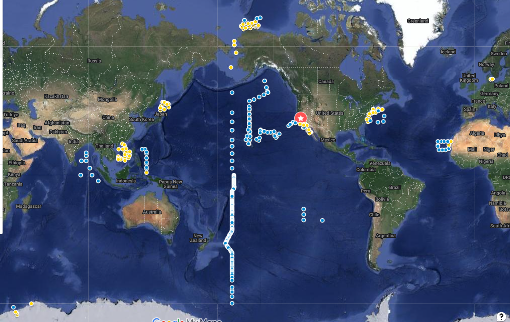
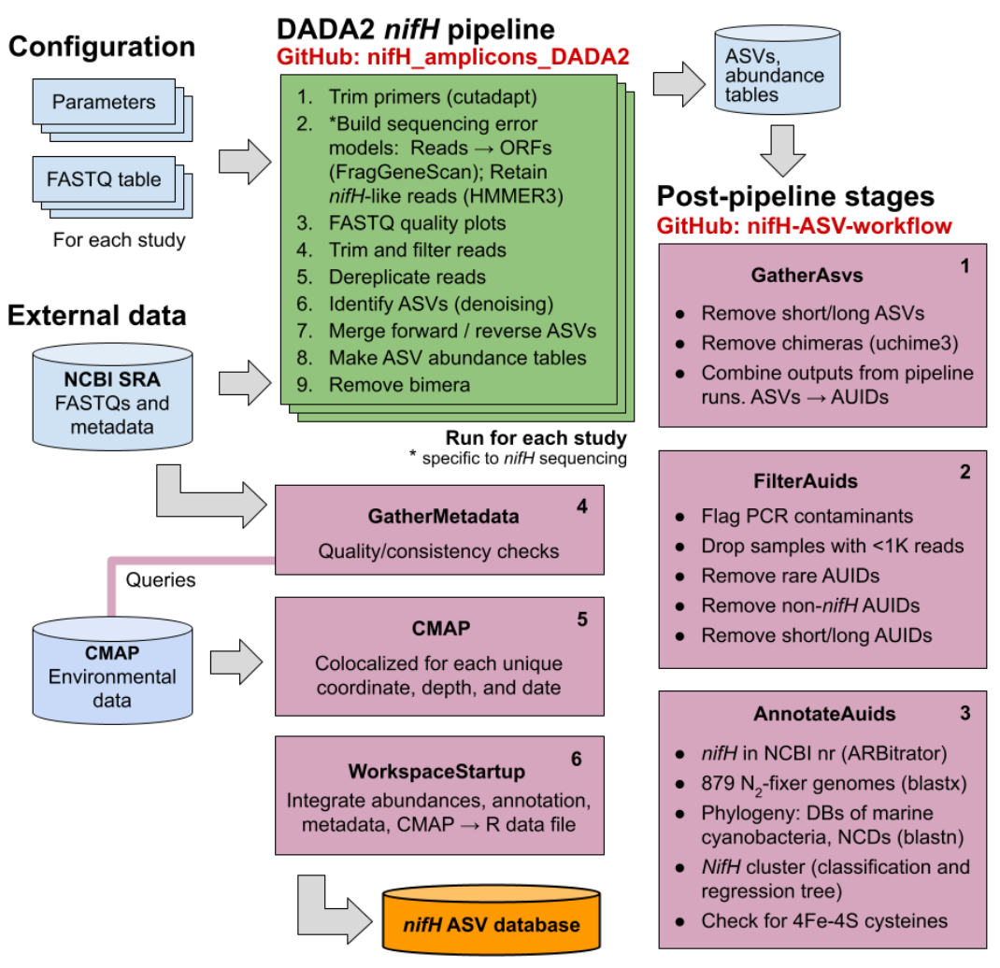

# Workflow for processing _nifH_ amplicon data sets

This repository contains all post-pipeline software stages and data deliverables described in [Morando, Magasin et al. 2025](https://doi.org/10.5194/essd-17-393-2025).  The workflow was used to process nearly all published _nifH_ amplicon MiSeq data sets that existed at the time of publication, as well as two new data sets produced by the [Zehr Lab](https://www.jzehrlab.com/) at [UC Santa Cruz](https://www.ucsc.edu/). The samples are shown in this map which links to an interactive Google map with study names, sample IDs, and collection information for each sample.
[](https://www.google.com/maps/d/u/0/edit?mid=1OlWftvxU_o7Fy3nFsSJDcUlbEWSX_U0&usp=sharing)


## Workflow overview

The following figure shows the workflow:

[DADA2](https://benjjneb.github.io/dada2/) ASVs were created by our [DADA2 _nifH_ pipeline](https://github.com/jdmagasin/nifH_amplicons_DADA2) (green). Post-pipeline stages (lavender), each executed by a Makefile or Snakefile, were used to gather the ASVs from all studies, filter the ASVs for quality, and annotate them, as well as to download sample-colocated environmental data from the [Simons Collaborative Marine Atlas Project (CMAP)](https://simonscmap.com).  The _nifH_ ASV database generated by the workflow will support future research into N<sub>2</sub>-fixing marine microbes.  The published database and any updated versions are available within the WorkspaceStartup directory, both as nifH_ASV_database.tgz as well as the R image, workspace.RData.  The published database is also available at [https://doi.org/10.6084/m9.figshare.23795943.v2](https://doi.org/10.6084/m9.figshare.23795943.v2).  


## Running the workflow

The workflow requires the [DADA2 _nifH_ pipeline](https://github.com/jdmagasin/nifH_amplicons_DADA2) as well as its ancillary tools.  Please see the Installation directory in the pipeline repository.  Then you must install the additional packages required by the post-pipeline stages as described in these [Installation instructions](Installation/INSTALL.txt).

The DADA2 _nifH_ pipeline outputs for all studies in the _nifH_ ASV database are provided in the Data directory.  So you do not need to run the pipeline to recreate the database.  However, if you wish to run the pipeline the parameters files used for each study are included in Data.  You are free to modify them.

Each of the post-pipeline stages 1 through 6 can be run -- in order -- by entering the associated directory and running "make" from your shell's command line.  For example, if I wanted to run the GatherAsvs stage I would do the following from the command line:

```bash session
(base) [jmagasin@thalassa]$ conda activate nifH_ASV_workflow
(nifH_ASV_workflow) [jmagasin@thalassa]$ cd GatherAsvs
(nifH_ASV_workflow) [jmagasin@thalassa]$ make &> log.18July2023.txt &
```

Here I am using a BASH shell (recommended).  First, I activate the nifH_ASV_workflow environment, a critical step that ensures that all tools and packages needed by the workflow are available.  Note that activation changes the prompt to begin with "(nifH_ASV_workflow)" on line two.  On the third line, I make the GatherAsvs stage and save the Makefile messages to a log file.  Most stages take at least a few minutes to complete so I run them in the background (the trailing &).

Please see documentation at the top of each Makefile for an overview of the stage.


***
_Copyright (C) 2023 Michael B. Morando and Jonathan D. Magasin_
